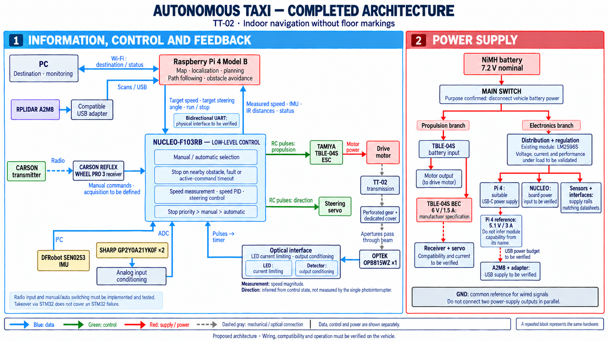

# auto_car — Autonomous Taxi

A three-person indoor autonomous vehicle project using the existing TT-02 chassis. An onboard monocular camera identifies a reference place or map region; lidar map matching, wheel-speed feedback and IMU information provide continuous planar pose. Users request the vehicle by scanning a location-specific QR code at a fixed pickup point. The vehicle plans and follows the route while handling obstacles in an environment without floor markings.

[Public repository](https://github.com/mzy410104-lgtm/auto_car) · [Current Issues](https://github.com/mzy410104-lgtm/auto_car/issues)

The repository currently contains a hardware inventory, architecture diagram, work plans and verification procedures. Completion of hardware tests, firmware and navigation software must be established from actual records. The code directories currently provide organizational entry points only.

## Start here

| Content | Document |
|---|---|
| Current two-week work cycle: tasks, hours and evidence | [CURRENT_WEEK_TASKS_EN.md](CURRENT_WEEK_TASKS_EN.md) |
| Overall project plan, revised localization method and three-person allocation | [TAXI_TT02_PROJECT_WORK_PLAN_EN.md](TAXI_TT02_PROJECT_WORK_PLAN_EN.md) |
| Foundational task board and existing GitHub issue mapping from before the scope revision | [TASK_BOARD.md](TASK_BOARD.md) |
| Git/GitHub collaboration workflow | [CONTRIBUTING.md](CONTRIBUTING.md) |
| Existing hardware | [EXISTING_HARDWARE_INVENTORY_EN.md](EXISTING_HARDWARE_INVENTORY_EN.md) |
| Additional parts and cost information | [TAXI_TT02_HARDWARE_BOM_EN.md](TAXI_TT02_HARDWARE_BOM_EN.md) |
| Architecture notes and authoritative logical workflow | [TAXI_TT02_ARCHITECTURE_NOTES_EN.md](TAXI_TT02_ARCHITECTURE_NOTES_EN.md) |
| Step-by-step hardware verification | [TAXI_TT02_VERIFICATION_STEPS_EN.md](TAXI_TT02_VERIFICATION_STEPS_EN.md) |
| Official mechanical source documents | [SOURCE_INDEX.md](sources/CoVAPSy_encoder_official/SOURCE_INDEX.md) |

The PNG below records the earlier hardware-and-power diagram. The revised camera-region, lidar-pose and fixed-pickup QR workflow is maintained in the [architecture notes](TAXI_TT02_ARCHITECTURE_NOTES_EN.md).



## Repository layout

Shared project documents are maintained in English. The six translated documents use the `_EN.md` suffix. The [original Chinese versions](https://github.com/mzy410104-lgtm/auto_car/tree/52771528af0162da6a0914f86091471245906574) remain in Git history. Original source images and the earlier French diagram are retained for traceability. Archived generation prompts retain the quoted labels used in that French diagram.

The following code and record directories define the repository structure; they do not imply that existing programs have already been imported:

```text
firmware/             STM32 project entry point
onboard/              Raspberry Pi software entry point
interfaces/           Interface agreements maintained by both endpoints
tests/records/        Small test records and evidence indexes
data/raw/             Large local raw data; Git tracks acquisition instructions only
sources/              Source index and original project image; manufacturer PDF/CAD copies are excluded from Git
.github/              Issue and Pull Request templates
```

## Collaboration

Define each task, its owner and completion evidence before editing files on a task branch. Use a Pull Request for another teammate to review before merging into main. Record source-code integration and physical-vehicle acceptance separately. See the [collaboration guide](CONTRIBUTING.md).

Each of the three members has approximately 10 hours per full workweek. Work is assigned and reviewed in six two-week cycles. Each cycle allocates 16 hours of tasks and 4 hours of debugging buffer per person, including meetings and joint integration sessions. Credit completed results against evidence; calendar progress alone does not establish completion.

## Source material and publication scope

Obtain third-party manuals and mechanical files through the original-source links; existing downloaded copies remain local. Local paths of original hardware photographs are retained in local backups, while public documents retain photograph numbers and filenames. Link large scan videos and recordings to test records through the instructions in data/raw.

The team has not selected a software license; no license grant has been added on its behalf. Referenced third-party material retains its own source and rights information.
