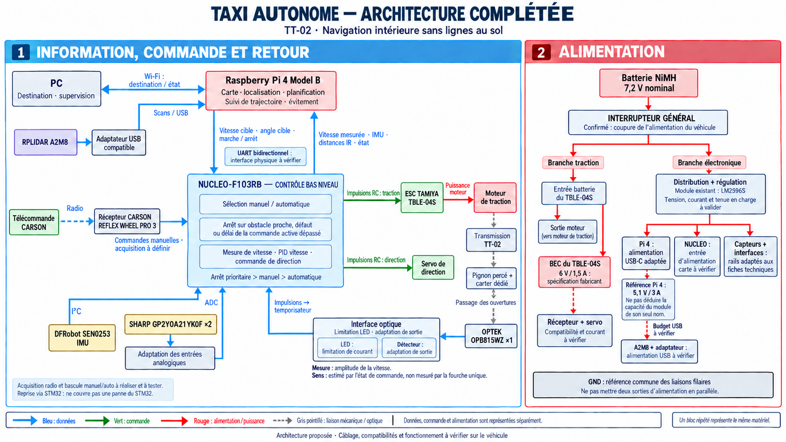

# auto_car — Taxi autonome

三人室内自动驾驶小车项目：使用现有TT-02，在无地面标线的环境中完成定位、目的地规划、路线跟随与障碍处理。

[公开仓库](https://github.com/mzy410104-lgtm/auto_car) · [当前Issues](https://github.com/mzy410104-lgtm/auto_car/issues)

当前已有硬件盘点、架构图、工作计划和核对规程。硬件实测、固件与导航程序的完成情况以实际记录为准；代码目录目前仅提供组织入口。

## 从这里开始

| 内容 | 入口 |
|---|---|
| 本轮任务和工时 | [CURRENT_WEEK_TASKS_ZH.md](CURRENT_WEEK_TASKS_ZH.md) |
| 完整项目安排 | [TAXI_TT02_PROJECT_WORK_PLAN_ZH.md](TAXI_TT02_PROJECT_WORK_PLAN_ZH.md) |
| 六项任务与完成证据 | [TASK_BOARD.md](TASK_BOARD.md) |
| Git/GitHub协作方式 | [CONTRIBUTING.md](CONTRIBUTING.md) |
| 已有硬件 | [EXISTING_HARDWARE_INVENTORY_ZH.md](EXISTING_HARDWARE_INVENTORY_ZH.md) |
| 补购与费用资料 | [TAXI_TT02_HARDWARE_BOM_ZH.md](TAXI_TT02_HARDWARE_BOM_ZH.md) |
| 架构说明 | [TAXI_TT02_ARCHITECTURE_NOTES_ZH.md](TAXI_TT02_ARCHITECTURE_NOTES_ZH.md) |
| 逐步硬件核对 | [TAXI_TT02_VERIFICATION_STEPS_ZH.md](TAXI_TT02_VERIFICATION_STEPS_ZH.md) |
| 原厂机械资料来源 | [SOURCE_INDEX.md](sources/CoVAPSy_encoder_official/SOURCE_INDEX.md) |



## 文件组织

现有根目录文档保持原文件名。以下代码与记录目录是本次新建的组织方案，不代表已有程序被迁入：

```text
firmware/             STM32工程入口
onboard/              树莓派软件入口
interfaces/           两端共同维护的接口约定
tests/records/        小型测试记录与证据索引
data/raw/             本地大型原始数据，Git只追踪获取说明
sources/              来源索引及项目原图；原厂PDF/CAD副本不纳入Git
.github/              Issue与Pull Request模板
```

## 协作约定

每项工作先明确任务、负责人和完成证据，再在任务分支修改文件；通过Pull Request让另一位组员复核后合并到main。源码合并与实车验收分开登记。具体流程见[协作说明](CONTRIBUTING.md)。

三人每人每完整工作周约10小时。当前计划每人8小时任务加2小时调试，会议与共同联调均已计入。已完成结果先核销，不按日历直接宣布阶段完成。

## 资料范围

第三方手册与机械文件通过原厂来源链接获取；本地既有下载副本仍保留。原始硬件照片的本机路径保留在本地备份中，公开文档保留照片编号与文件名。大型扫描录像/录制数据使用data/raw的说明与测试记录关联。

项目尚未确定软件许可证；本次没有替团队添加许可授权。引用的第三方资料保留各自来源及权利信息。
