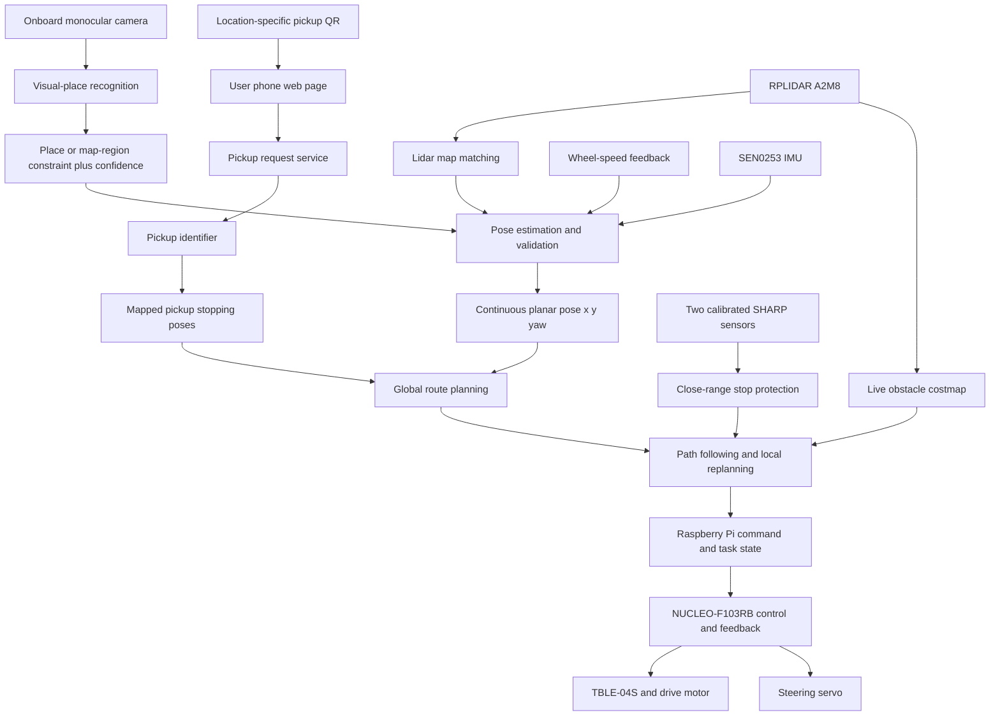

# TT-02 Autonomous Taxi: Architecture Notes

Original diagram date: 2026-09-08. Logical-architecture revision: 2026-09-22.

Basis: the user's handwritten architecture diagram and the project's current hardware inventory. The user explicitly confirmed that Interrupteur in the drawing means the battery main switch.

This deliverable describes a functional architecture and power-distribution proposal, not a verified wiring diagram of the physical vehicle. No wiring, power-up, firmware modification, mode switching, procurement or hardware tests were performed for it. The original handwritten photograph is unchanged.

The 2026-09-08 hardware-and-power diagram remains available as the [English architecture PNG](TAXI_TT02_ARCHITECTURE_EN.png). The [earlier French architecture PNG](TAXI_TT02_ARCHITECTURE_COMPLETED.png) is retained as a source version. These PNG files predate the adopted camera-region localization and fixed-pickup QR workflow. The logical architecture below is authoritative for those functions; the old PNG must not be used to claim that the camera, visual model, QR service or pose fusion has been implemented.

Companion procedure and record tables: [step-by-step verification](TAXI_TT02_VERIFICATION_STEPS_EN.md). No measured results have been entered in that procedure.

## Diagram review

The final French diagram was checked connection by connection: the lidar USB path connects separately to the Pi; UART command and feedback arrows have separate directions; I²C, conditioned ADC and photointerrupter timer paths enter the STM32 separately; ESC motor-power output and steering-servo control are separate; the BEC branches from the ESC; and the main switch precedes the propulsion/electronics split. The English version was also visually checked against these connections and the device labels and specifications. These checks concern the diagram only, not powered hardware or performance acceptance.

"Purpose confirmed" corresponds to the user's confirmation of the main switch's purpose, not measured disconnection capability. Dashed connections and power, interface or control details marked "to be verified", "to be validated" or "to be defined" still require implementation or verification.

## Relationships completed in the diagram

1. The PC and Raspberry Pi 4 exchange destinations and vehicle status over the network. The Pi handles mapping, localization, planning, path following and obstacle avoidance.
2. RPLIDAR A2M8 connects to the Pi through a compatible USB adapter. Adapter connections, power and USB load require verification.
3. Bidirectional communication is proposed between the Pi and NUCLEO-F103RB. The downlink carries target speed, target steering angle and run/stop commands. The uplink carries speed measurements, IMU data, infrared distances and status. The physical UART connection, pins, parameters and message format have not been defined.
4. The proposed STM32 functions are control-source selection, stop-condition evaluation, speed measurement, speed PID and steering control. Stop conditions take priority over manual and automatic commands. This is logic to be implemented, not a claim that the firmware already provides these functions.
5. The CARSON transmitter sends manual commands through its receiver to the STM32 for selection. Receiver-signal acquisition and manual/automatic switching still require design and verification. This arrangement depends on a working STM32; it is not hardware takeover that remains independent during an STM32 failure.
6. The STM32 sends RC control pulses to the TBLE-04S ESC, which supplies power to the motor. Another STM32 output controls the steering servo. These must remain separate circuits. The current motor type is unconfirmed, so the diagram uses "drive motor".
7. The drive motor turns the perforated gear through the TT-02 mechanical transmission, and one OPB815WZ detects it. The LED requires current limiting and the phototransistor output requires conditioning before entering the STM32 timer. The interface box is not a detailed resistor-wiring diagram.
8. Single-photointerrupter feedback provides speed magnitude. Direction is inferred from validated control state. Conversion from perforated-gear counts to vehicle speed still requires the actual aperture structure, counting method, transmission relationship and effective tire circumference.
9. SEN0253 connects to the STM32 over I²C. The analog outputs of the two GP2Y0A21YK0F sensors connect to ADC inputs through verified input conditioning. Power, signal levels, pins and protection still need to be established.

## Adopted logical architecture: visual region constraint, continuous lidar pose and fixed pickup QR

The onboard camera and the phone QR scanner are separate paths. The camera observes the environment and produces a validated place or map-region constraint. It does not replace continuous metric localization. Lidar map matching is the primary correction for the planar pose `(x, y, yaw)`. Wheel-speed and IMU measurements support short-term motion estimation and timing consistency. A validated visual result may constrain initial placement, check consistency or assist recovery after localization loss.

Each pickup point has its own QR code. Scanning it produces a pickup identifier, not a measured phone position. After the lidar map exists, B records a feasible stopping pose and arrival heading for every enabled pickup identifier. Route planning consumes that mapped pose. The QR code's physical wall position is not automatically the vehicle stopping pose.

The two SHARP sensors provide calibrated close-range protection. They are not map-position measurements. Obstacle detection, protective stopping, route detouring and reporting that no route exists remain separate acceptance results.

## Interpreting the power diagram

- 7.2V is the NiMH battery's nominal voltage, not a fixed measured voltage under every condition.
- After the main switch, battery power splits into an ESC propulsion branch and an electronics branch. The ESC main input is not supplied by the 5V buck-converter output.
- "Distribution + regulation" describes distribution and regulation functions. The confirmed module is LM2596S; this does not establish that a separate PDB is already available or that the vehicle's loaded supply capability follows from the module name.
- Design supplies for the Pi, NUCLEO, sensors and interface circuits according to their individual requirements. Total load capability, actual voltage drop and temperature rise have not been verified. The Pi 4's 5.1V/3A recommendation is an official supply reference, not a verified budget for all vehicle electronics.
- The TBLE-04S BEC's 6V/1.5A output is a manufacturer specification. The receiver/servo supply path is marked for compatibility and load checks; the diagram does not establish that the current servo and receiver have passed those checks.
- Do not directly parallel the BEC positive output with another regulator's positive output, or connect it to the Pi supply. Common ground provides a wired signal reference; it does not mean connecting positive supply outputs together.
- Determine the NUCLEO power input and jumpers from the actual interface in use and the board manual. When USB is used for debugging/communication, also establish its relationship to external power selection.

## Measured or verified information needed for the next wiring design

For every interface, record the source, destination, signal type, operating levels, actual connector and pins, supply source and ground relationship. For UART, also record actual parameters and the agreement between both endpoints. Verify analog-input range and RC-control timing and endpoints. Leave unsupported values blank.

## Original material and generation method

- User-supplied original image filename: `0874c16f93c3d3743d81840d84a89624.jpg`. Its original local path is retained in a local backup.
- Unmodified archived image: [original architecture drawing](sources/architecture/ARCHITECTURE_ORIGINAL_2026-09-08.jpg).
- Existing hardware: [inventory](EXISTING_HARDWARE_INVENTORY_EN.md).
- The built-in image_gen tool completed and rearranged the original drawing, and later localized the completed diagram into English.
- Original generation prompt: [prompt](TAXI_TT02_ARCHITECTURE_COMPLETED_PROMPT.txt).
- Connection-correction prompt: [correction prompt](TAXI_TT02_ARCHITECTURE_CORRECTION_PROMPT.txt).
- Final old-line cleanup prompt: [cleanup prompt](TAXI_TT02_ARCHITECTURE_FINAL_CLEANUP_PROMPT.txt).
- IMU connection-restoration prompt: [I²C connection prompt](TAXI_TT02_ARCHITECTURE_IMU_LINK_PROMPT.txt).
- English localization prompt: [English prompt](TAXI_TT02_ARCHITECTURE_EN_PROMPT.txt).

## Specification sources

- [Official Raspberry Pi power-supply guidance](https://www.raspberrypi.com/documentation/computers/raspberry-pi.html#power-supply).
- [Official TAMIYA TBLE-04S manual](https://cdn.simba-dickie-group.de/downloads/300045069/300045069_TBLE-04S.pdf).
- [Official OPTEK OPB815 datasheet](https://www.ttelectronics.com/TTElectronics/media/ProductFiles/Datasheet/OPB815.pdf).
- [Official NUCLEO MB1136 manual](https://www.st.com/resource/en/user_manual/um1724-stm32-nucleo64-boards-mb1136-stmicroelectronics.pdf).
